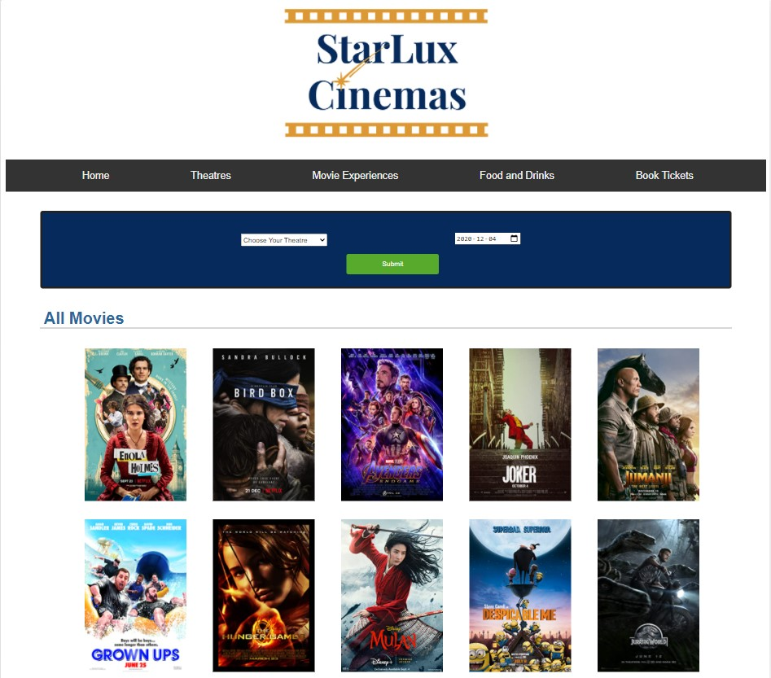

# StarLux-Cinemas

## Description

This is a Theatre Booking Website where the user can select their preferred theatre location, movie, seats and book tickets. The user is required to create an account or login before booking their tickets.

## Technologies

The IMDB API was used to display movie posters on the main page, so all the data is loaded at runtime through API calls. WAMPServer is the local web server that is used to host the website. The front-end is implemented with HTML5, CSS and JavaScript. The back-end is implemented with PHP and MySQL.

## Running the Application

Place the unzipped file into the www directory in your WAMPServer. Start the server and navigate to `localhost:8080/main-page.html` to view the input form.

## Preview

